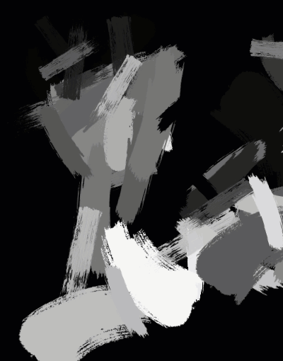
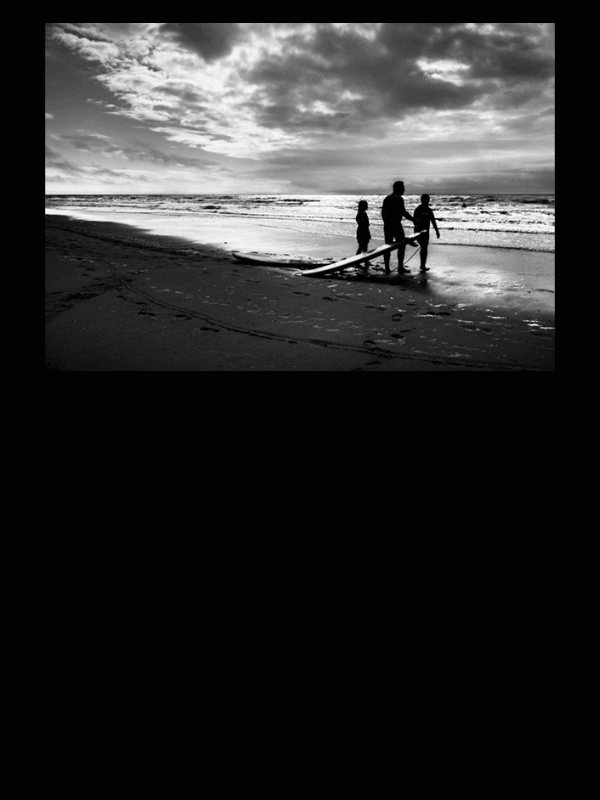

# Genetic Drawing
This is a toy project I did around 2017 for imitating drawing process from a target image (inspired by many examples of genetic drawing on the internet, and this was my take on it, mostly as an exercise). 

Due to a popular request, it is now opensource 🙂

Examples of generated images:

 

